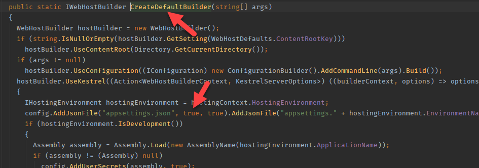
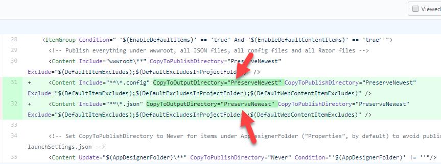
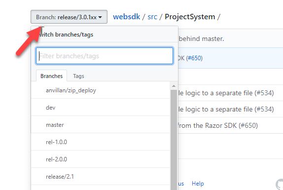

# The Problem

After I added the following lines to the `Program.cs` file, our asp.net core application started failing only in locally:

```
var configuration = new ConfigurationBuilder()
                .AddJsonFile("appsettings.json")
                .AddCommonVariables()
                .Build();

```

The failure message involves the missing of `appsettings.json` file during application startup.

I added them since I needed them before the `WebHost.CreateDefaultBuilder()` call. 

## Key Assumptions

- The application continued working properly when it is published.
- Interestingly, I have observed that when using .NET Core 3.0 build tools, the application didn't fail. It only happened with .NET Core 2.2.
- The exact step up to reproduce the problem follows:
    - .NET 2.2.x
    - Use commands like `dotnet run` or `dotnet build` and run afterwards.

# The Reason

First of all, the problem happens because `appsettings.json` is not copied to the output folder. You may wonder why not simply add the following lines to the `.csproj` file in the first place:

```
  <ItemGroup>
    <None Include="*.json">
      <CopyToOutputDirectory>PreserveNewest</CopyToOutputDirectory>
    </None>
  </ItemGroup>
  ```

That's right but not enough to understand the root cause here. And this post is all about understanding the root causes. Here, we are going to deep dive into the reason why it does not work with .NET Core 2.2 but .NET Core 3, and so on.

`appsettings.json` file was actually never copied. We didn't get any exception before the change, because loading it is optional.  `CreateDefaultBuilder()` is what calls `AddJson()` and it passes `optional` `true`. So it the file is not in the output folder, the app won't crash. Check the source code of Asp.NET Core below:



After adding the following piece of code, `appsettings.json` become required:

```
var configuration = new ConfigurationBuilder()
                .AddJsonFile("appsettings.json")
                .AddCommonVariables()
                .Build();
```

All these are clear, now. 

## Why does it work in .NET Core 3 then?

It was interesting to see that `appsettings.json` was actually being copied over to the output folder when running `dotnet run` or `dotnet build`. The answer I needed I found on Github:

David Fowler (an architect on .NET Team) has made this commit a while ago: https://github.com/aspnet/websdk/pull/593

The important piece is the following lines:



He didn't like the fact that `.json` files like `appsettings.json` are not automatically copied over to the output folder whereas they were copied to the publish folder, and he made the change. However, the problem is that his changes didn't make into `2.2.x` version but into `dotnet 3.x`. If you look at the source codes by choosing the tags, you will see it yourself:



This also explains why `dotnet publish` was copying `appsettings.json` file. The default target files already had `CopyToPublishDirectory` defined in them.

# Conclusion

If you are working with .NET Core 2.2 and explicity requiring the existence of `appsettings.json`, then you need to add the following lines to your `.csproj` file:

```
  <ItemGroup>
    <None Include="*.json">
      <CopyToOutputDirectory>PreserveNewest</CopyToOutputDirectory>
    </None>
  </ItemGroup>
```

But, if you are using .NET Core 3.0, then you are fine. You don't have to change anything in your `.csproj` files. 